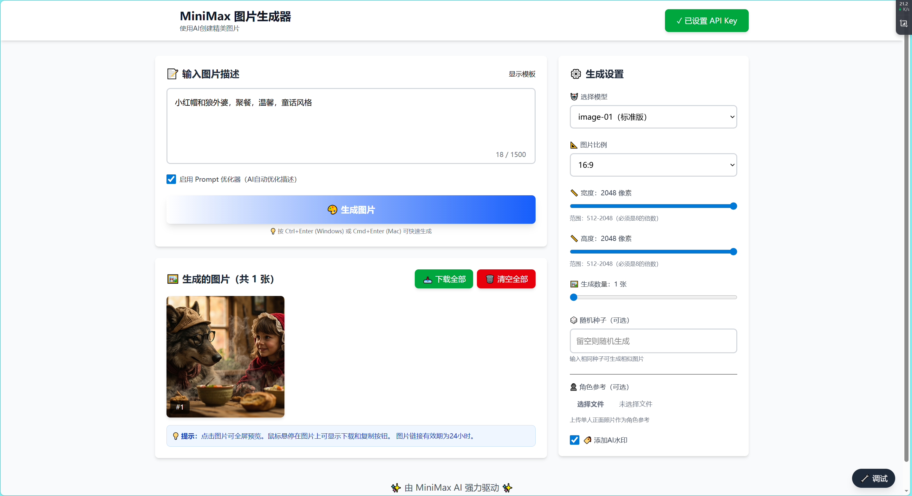

# 🎨 MiniMax 图片生成器

一个现代化的 Web 应用程序，通过 MiniMax AI API 实现文本到图像的智能生成。


[](https://github.com/cjc-github/minimax-image/stargazers)
[](https://github.com/cjc-github/minimax-image/network/members)
[](https://opensource.org/licenses/MIT)

## 📸 项目预览



---


## ✨ 功能特点

- 🔤 **文本转图片**：通过文本描述创建精美图片
- 🤖 **双模型支持**：image-01 和 image-01-live 两种AI模型
- 🎨 **画风控制**：漫画、元气、中世纪、水彩等多种画风选择
- 📐 **灵活比例**：支持 1:1, 16:9, 4:3, 3:2, 3:4, 9:16, 21:9 等多种比例
- 📏 **自定义尺寸**：可调整图片宽度和高度（512-2048px）
- 📦 **批量生成**：一次性生成 1-9 张图片
- 👤 **角色参考**：上传人脸照片进行角色定制生成
- 👁️ **图片预览**：网格视图和全屏预览
- 📥 **下载功能**：支持单张或批量下载
- 🔧 **Prompt优化**：可选启用 AI 驱动的提示词优化
- 📱 **响应式设计**：完美支持桌面和移动设备
- 🇨🇳 **中文界面**：完整的中文用户界面

## 🛠️ 技术栈

- **前端框架**: React 18 + TypeScript
- **构建工具**: Vite
- **样式方案**: Tailwind CSS v4
- **API服务**: MiniMax Image Generation API
- **包管理**: npm

## 🚀 快速开始

```bash
# 克隆项目
git clone https://github.com/cjc-github/minimax-image.git

# 进入目录
cd minimax-image

# 进入前端目录
cd frontend

# 安装依赖
npm install

# 启动开发服务器
npm run dev
```

然后打开浏览器访问 http://localhost:5173

---

## 📦 安装与设置

### 环境要求

- Node.js 16.0 或更高版本
- npm 8.0 或更高版本

### 安装步骤

#### 1. 克隆项目

```bash
git clone https://github.com/cjc-github/minimax-image.git
cd minimax-image
```

#### 2. 进入前端目录

```bash
cd frontend
```

#### 3. 安装依赖

```bash
npm install
```

> ⚠️ 如果安装缓慢，可以使用淘宝镜像：
> ```bash
> npm install --registry=https://registry.npmmirror.com
> ```

#### 4. 启动开发服务器

```bash
npm run dev
```

#### 5. 打开浏览器

访问 http://localhost:5173

### 构建生产版本

```bash
# 构建
npm run build

# 预览生产构建
npm run preview
```

## 🔑 获取 API 密钥

### 1. 注册/登录 MiniMax 平台

访问 [MiniMax 开放平台](https://platform.minimaxi.com) 并注册账户。

### 2. 获取 API 密钥

1. 登录后进入控制台
2. 点击"账户管理" → "接口密钥"
3. 点击"创建密钥"按钮
4. 复制生成的 API 密钥

### 3. 在应用中设置

1. 打开应用后，点击右上角的 **"⚠️ 请设置 API Key"** 按钮
2. 将 API 密钥粘贴到输入框中
3. 点击 **"保存密钥"** 按钮
4. 按钮会变成绿色的 **"✓ 已设置 API Key"**

## 📖 使用说明

### 基本使用流程

#### 步骤 1：设置 API 密钥

- 点击右上角的红色警告按钮
- 输入并保存您的 API 密钥

#### 步骤 2：输入图片描述

在文本框中输入您想要的图片内容，例如：
- "一只可爱的橘猫在阳光下打盹"
- "未来城市的科幻风格建筑"
- "梦幻般的海边日落风景"

#### 步骤 3：调整设置（可选）

右侧面板提供多种设置选项：

**模型选择**：
- `image-01`：标准模型，支持自定义尺寸
- `image-01-live`：增强模型，支持画风控制

**图片比例**：
选择适合的宽高比，如正方形、宽屏、竖屏等。

**尺寸设置**（仅 image-01）：
- 宽度：512-2048 像素
- 高度：512-2048 像素
- 必须为 8 的倍数

**画风设置**（仅 image-01-live）：
- 漫画、元气、中世纪、水彩

**生成数量**：
- 滑块控制：1-9 张

**其他选项**：
- Prompt 优化器：启用 AI 自动优化
- AI 水印：添加水印标识
- 随机种子：输入相同种子可复现结果

#### 步骤 4：生成图片

点击 **"🎨 生成图片"** 按钮或按 `Ctrl+Enter`（Windows）/ `Cmd+Enter`（Mac）。

#### 步骤 5：预览和下载

**网格视图**：
- 鼠标悬停显示操作按钮
- 点击图片放大预览
- 悬停显示下载、复制链接按钮

**全屏预览**：
- 点击任意图片进入全屏模式
- 可下载、复制链接或在新标签页打开
- 点击背景或按 ESC 关闭

## 📁 项目结构

```
minimax-image/
├── frontend/                          # 前端应用
│   ├── src/
│   │   ├── components/              # React 组件
│   │   │   ├── Header.tsx           # 页头导航和 API 密钥设置
│   │   │   ├── PromptInput.tsx      # 提示词输入区域
│   │   │   ├── SettingsPanel.tsx    # 生成参数设置
│   │   │   └── ImagePreview.tsx      # 图片预览和下载
│   │   ├── hooks/                   # 自定义 React Hooks
│   │   │   └── useImageGeneration.ts # 图片生成逻辑
│   │   ├── services/                # API 服务层
│   │   │   └── api.ts               # MiniMax API 调用
│   │   ├── types/                   # TypeScript 类型定义
│   │   │   └── index.ts             # 接口和类型定义
│   │   ├── App.tsx                  # 主应用组件
│   │   ├── main.tsx                 # 应用入口
│   │   └── index.css                # 全局样式
│   ├── public/                      # 静态资源
│   ├── tailwind.config.js           # Tailwind CSS 配置
│   ├── postcss.config.js            # PostCSS 配置
│   ├── vite.config.ts               # Vite 配置
│   ├── tsconfig.json                # TypeScript 配置
│   └── package.json                 # 项目依赖
├── .gitignore                       # Git 忽略文件
└── README.md                        # 项目文档
```

## ⚙️ 配置选项详解

### 模型对比

| 特性 | image-01 | image-01-live |
|------|---------|---------------|
| 自定义尺寸 | ✅ 支持 | ❌ 不支持 |
| 画风控制 | ❌ 不支持 | ✅ 支持 |
| 推荐场景 | 高清输出、专业用途 | 艺术创作、快速生成 |

### 图片比例说明

- **1:1**：正方形，适合社交媒体头像
- **16:9**：宽屏，适合横版海报、壁纸
- **4:3**：标准比例，适合博客配图
- **3:2**：照片比例，适合摄影作品
- **3:4**：竖屏，适合手机壁纸
- **9:16**：手机竖屏，适合故事内容
- **21:9**：超宽屏，适合全景图

### 画风类型

- 🎨 **漫画**：卡通风格的图像
- ⚡ **元气**：充满活力的风格
- 🏰 **中世纪**：复古中世纪风格
- 🌊 **水彩**：水彩画效果

## 🔧 常见问题

### Q1: 为什么点击"生成图片"没有反应？

**A**: 请检查以下几点：
- ✅ 已设置 API 密钥（右上角按钮应为绿色）
- ✅ 已输入图片描述
- ✅ API 密钥有效且有余额

### Q2: 生成失败，显示错误信息？

**A**: 常见错误及解决方法：

| 错误代码 | 含义 | 解决方法 |
|---------|------|---------|
| 1002 | 触发限流 | 稍后再试 |
| 1004 | API密钥无效 | 检查并重新设置密钥 |
| 1008 | 余额不足 | 充值账户 |
| 1026 | 描述涉及敏感内容 | 修改提示词 |
| 2013 | 参数异常 | 检查参数设置 |

### Q3: 如何生成多张不同风格的图片？

**A**: 
1. 在设置面板调整"生成数量"为 2-9
2. 使用不同的 prompt 描述
3. 尝试不同的画风设置

### Q4: 图片下载失败？

**A**: 尝试以下方法：
1. 右键点击图片，选择"在新标签页打开"
2. 在新页面中右键选择"图片另存为"
3. 点击图片下方或全屏预览中的下载按钮

### Q5: 如何复现之前的生成结果？

**A**: 
1. 在设置面板的"随机种子"输入框中输入一个数字
2. 保持其他参数不变
3. 相同 seed 值会产生相似的结果

### Q6: API 密钥安全吗？

**A**: 当前版本将密钥存储在浏览器 localStorage 中。这适合：
- ✅ 个人使用
- ✅ 开发测试

生产环境建议：
- ❌ 避免在生产环境存储在前端
- ✅ 建议部署后端服务保护密钥

## 🔒 安全说明

### 当前版本的安全考量

1. **API 密钥存储**：存储在浏览器 localStorage
   - ✅ 方便个人使用
   - ⚠️ 不适合多人共用设备
   - ⚠️ 可能受到 XSS 攻击

2. **生产环境部署建议**
   ```typescript
   // 不推荐：前端直接调用 API
   // 推荐：后端代理
   前端 → 后端服务 → MiniMax API
   ```

### 安全最佳实践

- 🔒 不要将 API 密钥提交到 Git 仓库
- 🔒 定期更换 API 密钥
- 🔒 生产环境使用后端服务
- 🔒 启用 HTTPS 加密传输

## 🚀 部署指南

### 方式一：静态部署（当前版本）

适用于 Vercel、Netlify、Github Pages 等静态托管服务：

```bash
# 构建
npm run build

# 产物在 dist 目录
# 上传到任意静态托管服务即可
```

### 方式二：Docker 部署

创建 `Dockerfile`：

```dockerfile
FROM node:18-alpine as builder
WORKDIR /app
COPY package*.json ./
RUN npm ci
COPY . .
RUN npm run build

FROM nginx:alpine
COPY --from=builder /app/dist /usr/share/nginx/html
EXPOSE 80
CMD ["nginx", "-g", "daemon off;"]
```

构建和运行：

```bash
docker build -t minimax-image .
docker run -p 8080:80 minimax-image
```

## 🐛 故障排除

### 开发环境问题

**问题：启动失败，端口被占用**

```bash
# Windows
netstat -ano | findstr :5173
taskkill /PID <PID> /F

# Linux/Mac
lsof -i :5173
kill -9 <PID>
```

**问题：修改代码后页面未更新**

1. 检查浏览器控制台是否有错误
2. 尝试清除浏览器缓存
3. 重启开发服务器

**问题：TypeScript 类型错误**

```bash
npm install
```

### 构建问题

**问题：构建失败，内存不足**

```bash
# 增加 Node.js 内存限制
export NODE_OPTIONS="--max-old-space-size=4096"
npm run build
```

## 📊 API 文档

### 端点

```
POST https://api.minimaxi.com/v1/image_generation
```

### 请求格式

```json
{
  "model": "image-01",
  "prompt": "图片描述文本",
  "aspect_ratio": "1:1",
  "n": 1,
  "response_format": "url"
}
```

### 响应格式

```json
{
  "id": "任务ID",
  "data": {
    "image_urls": ["图片URL列表"]
  },
  "metadata": {
    "success_count": "成功数量",
    "failed_count": "失败数量"
  },
  "base_resp": {
    "status_code": 0,
    "status_msg": "success"
  }
}
```

### 速率限制

- 默认：每秒 1 个请求
- 批量生成：每 10 秒最多 9 张图片
- 超出限制返回 1002 错误码

## 🤝 贡献指南

欢迎提交 Issue 和 Pull Request！

👉 [在 GitHub 上查看项目](https://github.com/cjc-github/minimax-image)

### 开发流程

1. Fork 本仓库：https://github.com/cjc-github/minimax-image/fork
2. 创建特性分支：`git checkout -b feature/AmazingFeature`
3. 提交更改：`git commit -m 'Add some AmazingFeature'`
4. 推送分支：`git push origin feature/AmazingFeature`
5. 创建 Pull Request 到 [https://github.com/cjc-github/minimax-image](https://github.com/cjc-github/minimax-image/pulls)

## 📝 更新日志

### v1.0.0 (2024-04-07)

- ✨ 初始版本发布
- 🎨 支持文本到图片生成
- 🤖 双模型支持
- 📐 多种图片比例
- 🎨 画风控制
- 👤 角色参考功能
- 📥 图片预览和下载
- 🇨🇳 完整中文界面

## 📧 联系方式

- **项目主页**: [GitHub - cjc-github/minimax-image](https://github.com/cjc-github/minimax-image)
- **问题反馈**: [Issue 反馈](https://github.com/cjc-github/minimax-image/issues)
- **API 文档**: [MiniMax API 文档](https://platform.minimaxi.com/document/)

---

### ⭐ 支持一下

如果你觉得这个项目对你有帮助，请给我一个 Star！

[](https://github.com/cjc-github/minimax-image)

## 📄 许可证

本项目采用 MIT 许可证 - 详见 [LICENSE](LICENSE) 文件

---

## 🙏 致谢

- [MiniMax](https://www.minimax.io/) - 提供强大的图像生成 API
- [React](https://react.dev/) - 优秀的前端框架
- [Tailwind CSS](https://tailwindcss.com/) - 实用的 CSS 框架
- [Vite](https://vitejs.dev/) - 快速的构建工具

---

**Made with ❤️ by AI Assistant**
